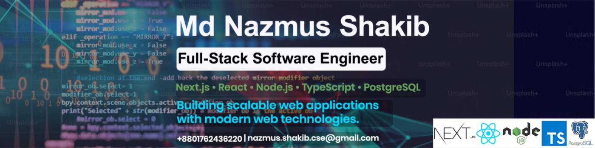

# Hello 👋, I'm Md Nazmus Shakib 
  

### ⚡ Full-Stack Software Engineer | Passionate about Performance, Security, and Scalable Backend Systems

## 👋 About Me

I'm a passionate developer who loves building impactful digital solutions with clean code, modern UI, and scalable backends. From crafting frontend interfaces to developing efficient APIs, I enjoy every step of the dev journey.

- 🔭 I’m currently building scalable web applications with React.js, Next.js, and TypeScript.
- 🤝 I’m proficient in Node.js, Express.js, MongoDB, Prisma, and REST API development.
- 🌱 I’m currently learning Docker, AWS, Redis, and Advanced System Design.
- 💬 Ask me about Full-Stack Development, REST APIs, Authentication, RBAC, and Web Scalability.
- ⚡ Fun fact: I enjoy turning real-world business problems into practical software solutions and continuously improving my code.

## 🚀 Tech Stack:

### 📈 GitHub Stats

<!-- Keep ONLY ONE streak widget -->

<!-- Top Languages (unique data) -->

---

### 📬 Let's Connect

  
  

---

_"Code is like humor. When you have to explain it, it's bad." – Cory House_

